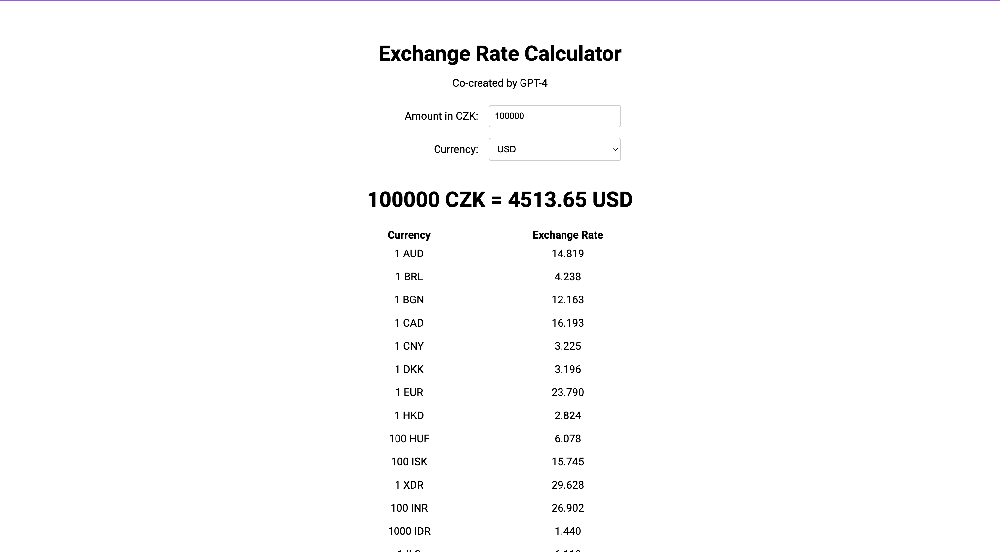

# Exchange Rate Calculator

This is a simple React-based web application that helps users convert an amount in Czech Koruna (CZK) to various other currencies using up-to-date exchange rates provided by the Czech National Bank. The application also displays a table of the available currencies and their corresponding exchange rates.



## Features

- Convert amount in CZK to other currencies
- Display a table with available currencies and their exchange rates
- Automatically update exchange rates from the Czech National Bank

## Prerequisites

Before you can set up and run the application, you need to have the following software installed on your system:

- [Node.js](https://nodejs.org/)
- [npm](https://www.npmjs.com/) (usually comes with Node.js)

## Installation

1. Clone the repository:

```bash
git clone https://github.com/vasek/currency-converter.git
```

2. Navigate to the project folder:

```bash
cd currency-converter
```

3. Install the required dependencies:

```bash
npm install
```

### Running the Application

1. Run the React development server:

```bash
npm start
```

The application should now be running on `http://localhost:3000`.

2. In a separate terminal window, run the CORS proxy server:

```bash
npm run proxy
```

The proxy server should now be running on [http://localhost:3001](http://localhost:3001).

The proxy server is required to bypass the CORS restriction when fetching data from the CNB API. The React application will make requests to the proxy server, which will then forward the requests to the CNB API.

## Built with

- [React](https://reactjs.org/)
- [TypeScript](https://www.typescriptlang.org/)
- [React Query](https://react-query.tanstack.com/)
- [styled-components](https://styled-components.com/)
- [Express](https://expressjs.com/)
- [Node.js](https://nodejs.org/)

## Co-created by

GPT-4 and Vaclav Ostrozlik
